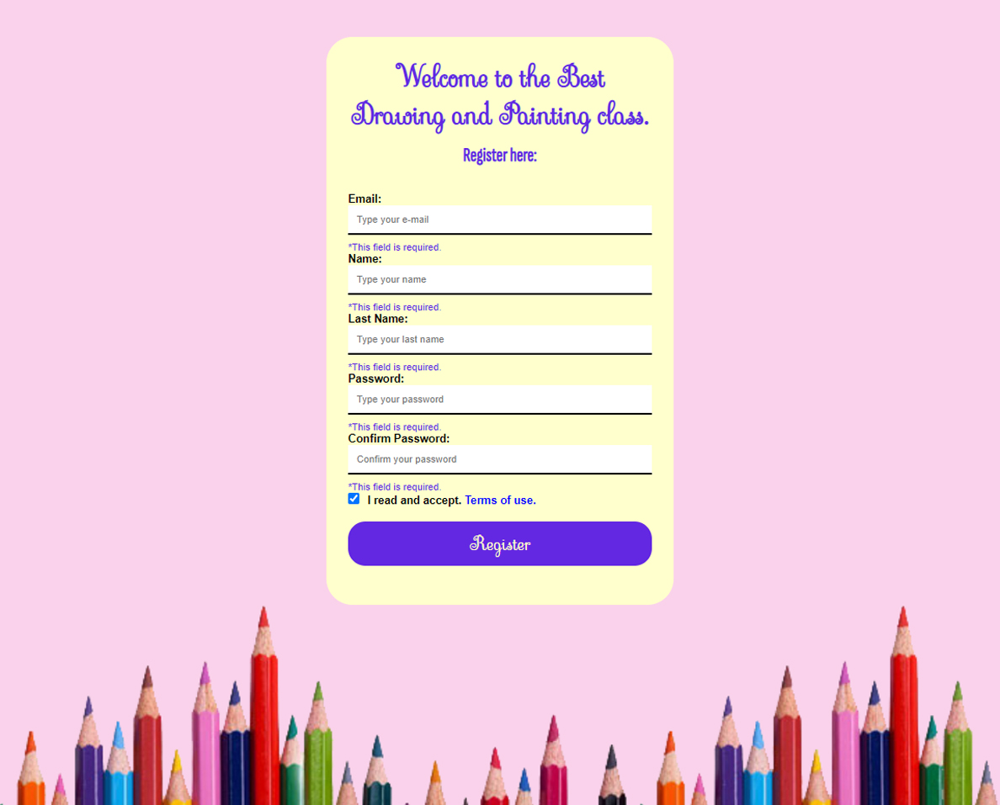

<h1>Form validation.</h1>

<h2>🐱‍👤Features:</h2>

In this project, the challenge was to put object-oriented programming studies into practice, creating different validation methods to check if what was inserted by the user are the same as those required.

As the user interacts with the form, he receives explanatory error messages, guiding him to succeed in registering.

- This project is not yet interacting with a server.
- Deploy is in [Vercel](https://vercel.com).

<h2>🤖Tech:</h2>

<h2>📺Preview:</h2>

</img>

<h2>🕹Link Website:</h2>

https://caio-portfolio-xi.vercel.app/

<h2>🐱‍🏍Social media:</h2>

